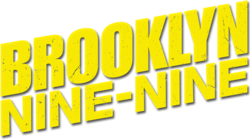

# Algorithms w/ Mike Schur

AwMS ("Algorithms w/ Mike Schur") is a three-part mini-series in which I demonstrate real-world applications of certain algorithms and offer viewers a visually engaging experience by leveraging their love of TV shows and disinterest in studies.

I'd take scenes and snippets from three shows - Brooklyn Nine-Nine, Parks and Recreation, and The Office (US) - and change the settings to match a certain algorithm (or a class of algorithms). There's a lot of entertaining material for the viewer to become hooked on, from treasure hunts to capturing criminals who have just escaped jail. The scenes will be carefully fabricated to suit an algorithm and provide the best analysis for every algorithm that I demonstrate.

## Motivation

Where do the students spend most of the time of the day in the 2020s? Textbooks? Research Papers? No! Netflix? Disney Plus? YES! Students love to binge shows day and night.
AwMS is a novel attempt to show the world how cool algorithms are and how analysis of these algorithms helps in real life. I would present an in-depth study of the decisions that the characters in AwMS must make (for example: find the most optimal approach as the bomb is going to explode any moment) to save the day.

I love to teach. I love visualizations. I love algorithms. So, I brought them all together, so anyone out there could simply watch a 20 minutes long episode of their favorite characters analyze and decide on using an optimal approach to be the hero of the day.

## Algorithms

The algorithms covered in this mini-series would be divided into 3 categories, where each episode would be covering a specific domain of algorithms.

### AwMS EP1: Graph Algorithms w/ The Nine-Nine Squad

The first episode would involve uncovering a typical Halloween heist and catching criminals who have recently escaped from prison and are SUPER DANGEROUS! Jake and Amy join forces with Scully (why is Scully here? Watch the episode to find out) to solve the heist and restore peace to New York City's streets.

Algorithms such as Shortest Path Algorithms, Strongly Connected Components, DFS, BFS, and Minimum Spanning Trees, etc. will be demonstrated.

### AwMS EP2: Greedy Algorithms w/ Dunder Mifflin

The second episode would reveal The Office's Office Olympics episode, in which Michael (World's Greatest Boss) takes a day off and the employees of Dunder Mifflin decide to arrange a little Olympics in their modest office area. This episode is absolutely packed with entertaining games in which Jim outperforms the others by taking more greedy approaches to complete the goals.

Algorithms such as Hamming Code, Job-Scheduling, Sorting, Web Searching, PageRank, etc. will be demonstrated.

### AwMS EP3: Optimization Algorithms w/ The Parks Department

The final episode in the mini-series would take us to the humble town of Pawnee, Indiana where we see the Parks and Recreation Department go about solving a treasure hunt set up by Leslie (their boss) by using the most unconventional ideas. The winner of the treasure hunt gets a signed letter from Ron stating the following:

Respected Winner,

Congratulations.

Regards,
Ron
15-------
\---------

Algorithms such as Longest Increasing Subsequence, The Knapsack Problem, Multiplying Large Numbers, etc. will be demonstrated.

Note: The algorithms mentioned in each episode may or may not make it to the final cut. Algorithms are subject to change.

## Usecase

Learning your favorite algorithms was never this fun. This mini-series could help students better understand the applications behind the pieces of code they see in their copy of CLRS. Seeing characters choose between 2 different approaches (2 different algorithms) would help students internalize the cool aspect of the algorithm analysis and why it’s so useful.

## References

[1] Brooklyn Nine-Nine

Brooklyn Nine-Nine is an American police procedural comedy television series.

[2] The Office (US)

The Office is an American mockumentary sitcom television series that depicts the everyday work lives of office employees in the Scranton, Pennsylvania, branch of the fictional Dunder Mifflin Paper Company.

[3] Parks and Recreation

Parks and Recreation (also known as Parks and Rec) is an American political satire mockumentary sitcom television series.

_© No licenses have been acquired for the recreation of the content. All the rights belong to the National Broadcasting Company, United States._
