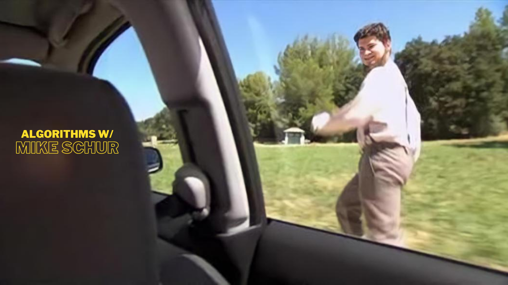
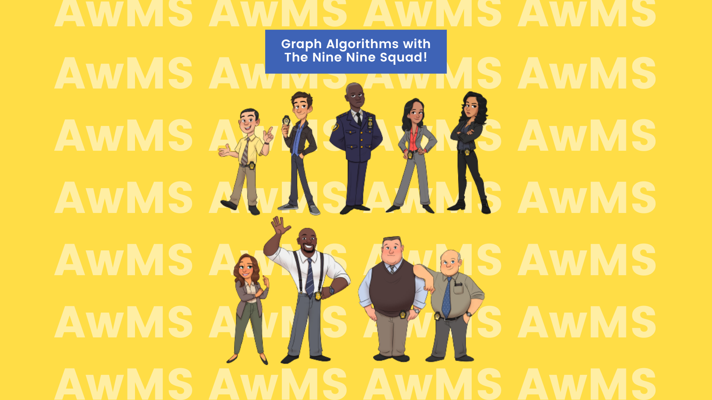
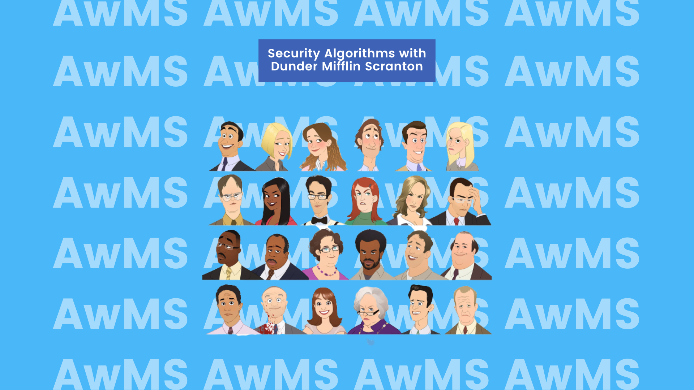
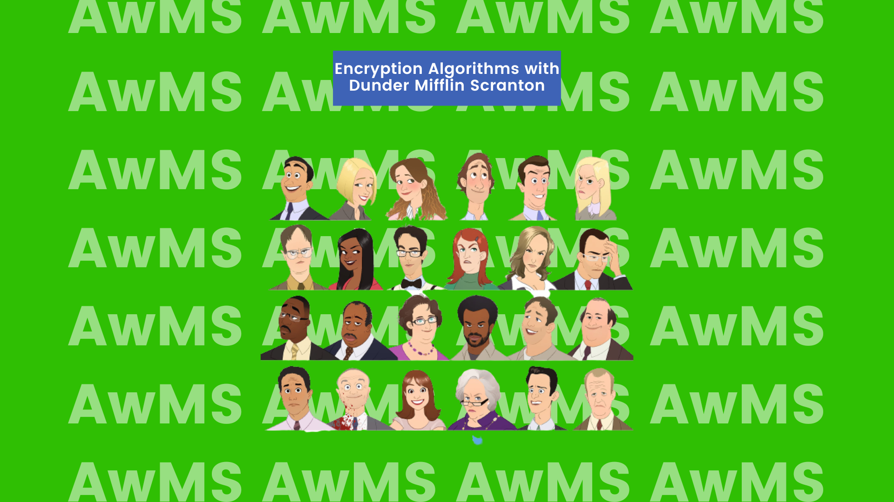
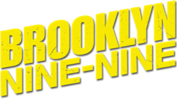

# Algorithms w/ Mike Schur



AwMS ("Algorithms w/ Mike Schur") is a three-part mini-series in which I demonstrate real-world applications of certain algorithms and offer viewers a visually engaging experience by leveraging their love of TV shows and disinterest in studies.

I'd take scenes and snippets from three shows - Brooklyn Nine-Nine, Parks and Recreation, and The Office (US) - and change the settings to match a certain algorithm (or a class of algorithms). There's a lot of entertaining material for the viewer to become hooked on, from treasure hunts to capturing criminals who have just escaped jail. The scenes will be carefully fabricated to suit an algorithm and provide the best analysis for every algorithm that I demonstrate.

[Streaming Link (All 3 episodes)](https://iiitaphyd-my.sharepoint.com/:f:/g/personal/freyam_mehta_students_iiit_ac_in/EpSxqunNCXJHpkyCwcr4UEwB4mnzLrZ9D0-jY0yXPyySKA?e=aEUZsB)

## Motivation

Where do the students spend most of the time of the day in the 2020s? Textbooks? Research Papers? No! Netflix? Disney Plus? YES! Students love to binge shows day and night.
AwMS is a novel attempt to show the world how cool algorithms are and how analysis of these algorithms helps in real life. I would present an in-depth study of the decisions that the characters in AwMS must make (for example: find the most optimal approach as the bomb is going to explode any moment) to save the day.

I love to teach. I love visualizations. I love algorithms. So, I brought them all together, so anyone out there could simply watch a 20 minutes long episode of their favorite characters analyze and decide on using an optimal approach to be the hero of the day.

## Algorithms

The algorithms covered in this mini-series would be divided into 3 categories, where each episode would be covering a specific domain of algorithms.

### AwMS EP1: MST with The Nine Nine Squad



In the first episode, we uncover a dangerous assignment that Captain Holt has bestowed upon the 99th Precinct. The squad goes on a freaking MANHUNT for a group of convicts who've escaped from a prison van on the streets of Brooklyn.

I illustrate the usefulness of Minimum Spanning Trees in this episode and how algorithms such as Prim's and Kruskal's help find the optimal paths in a given graph.

Brooklyn Nine-Nine Character Illustrations Credit: Luigi Lucarelli (Instagram: helloluigi)

<details>
<summary>Episode 1: MST with The Nine Nine Squad</summary>

#### Minimum Spanning Trees

A minimum spanning tree (MST) is a subgraph of a connected graph that is a tree and connects all the vertices together with minimum possible weight.

#### Prim’s Algorithm

The minimum spanning tree is built gradually by adding edges one at a time. At first the spanning tree consists only of a single vertex (chosen arbitrarily) in Prim’s Algorithm. Then the minimum
weight edge outgoing from this vertex is selected and added to the spanning tree. After that the spanning tree already consists of two vertices.

Now select and add the edge with the minimum weight that has one end in an already selected vertex (i.e. a vertex that is already part of the spanning tree), and the other end in an unselected vertex.
And so on, i.e. every time we select and add the edge with minimal weight that connects one selected vertex with one unselected vertex. The process is repeated until the spanning tree contains all
vertices. (or equivalently until we have n-1 edges).

In the end the constructed spanning tree will be minimal. If the graph was originally not connected, then there doesn’t exist a spanning tree, so the number of selected edges will be less than
n − 1.

```cpp

int n;
vector<vector<int>> adj;    // adjacency matrix of graph
const int INF = 1000000000; // weight INF means there is no edge

struct Edge {
    int w = INF, to = -1;
};

void prim() {
    int total_weight = 0;
    vector<bool> selected(n, false);
    vector<Edge> min_e(n);
    min_e[0].w = 0;

    for (int i = 0; i < n; ++i) {
        int v = -1;
        for (int j = 0; j < n; ++j) {
            if (!selected[j] && (v == -1 || min_e[j].w < min_e[v].w))
                v = j;
        }

        if (min_e[v].w == INF) {
            cout << "No MST!" << endl;
            exit(0);
        }

        selected[v] = true;
        total_weight += min_e[v].w;
        if (min_e[v].to != -1)
            cout << v << " " << min_e[v].to << endl;

        for (int to = 0; to < n; ++to) {
            if (adj[v][to] < min_e[to].w)
                min_e[to] = {adj[v][to], v};
        }
    }

    cout << total_weight << endl;
}
```

#### Proof

- Let the graph G be connected, i.e. the answer exists. We denote by T the resulting graph found by Prim’s algorithm, and by S the minimum spanning tree. Obviously T is indeed a spanning tree and a subgraph of G. We only need to show that the weights of S and T coincide. Consider the first time in the algorithm when we add an edge to T that is not part of S. Let us denote this edge with e, its ends by a and b, and the set of already selected vertices as V (a ∈ V and b /∈ V , or visa versa).
- In the minimal spanning tree S the vertices a and b are connected by some path P. On this path we can find an edge f such that one end of f lies in V and the other end doesn’t. Since the algorithm chose e instead of f, it means that the weight of f is greater or equal to the weight of e. We add the edge e to the minimum spanning tree S and remove the edge f. By adding e we created a cycle, and since f was also part of the only cycle, by removing it the resulting graph is again free of cycles. And because we only removed an edge from a cycle, the resulting graph is still connected. - - The resulting spanning tree cannot have a larger total weight, since the weight of e was not larger than the weight of f, and it also cannot have a smaller weight since S was a minimum spanning tree.
- This means that by replacing the edge f with e we generated a different minimum spanning tree. And e has to have the same weight as f. Thus all the edges we pick in Prim’s algorithm have the same weights as the edges of any minimum spanning tree, which means that Prim’s algorithm really generates a minimum spanning tree.

#### Kruskal’s Algorithm

The algorithm is a Greedy Algorithm. The Greedy Choice is to pick the smallest weight edge that does not cause a cycle in the MST constructed so far.
Proof:

1. Sort the edges in non-decreasing order of their weights.
2. Pick the smallest edge. Check if it forms a cycle with the spanning tree formed so far. If cycle is not formed, include this edge. Else, discard it.
3. Repeat step 2 until there are (V-1) edges in the spanning tree.
   Step 2 uses the Union-Find algorithm to detect cycles

```cpp
struct Edge {
    int u, v, weight;
    bool operator<(Edge const& other) {
        return weight < other.weight;
    }
};

int n;
vector<Edge> edges;

int cost = 0;
vector<int> tree_id(n);
vector<Edge> result;
for (int i = 0; i < n; i++)
    tree_id[i] = i;

sort(edges.begin(), edges.end());

for (Edge e : edges) {
    if (tree_id[e.u] != tree_id[e.v]) {
        cost += e.weight;
        result.push_back(e);

        int old_id = tree_id[e.u], new_id = tree_id[e.v];
        for (int i = 0; i < n; i++) {
            if (tree_id[i] == old_id)
                tree_id[i] = new_id;
        }
    }
}
```

</details>

### AwMS EP2: Homomorphic Encryption with The Dunder Mifflin Scranton



In the second episode's first part, we uncover an identity theft by Jim as he enters the office dressed as Dwight. He claims that he accidentally discovered Dwight's spectacles for four dollars at a pharmacy shop and couldn't resist duplicating the rest of Dwight's outfit for eleven dollars. We also see how the office is trying to remember their server password after Michael plugged in a space heater and a fan in the same plug.
I show how Homomorphic Encryption is important in our life and how it protects our privacy while we spend hours upon hours every day on different social media platforms. I also discuss SHA-256 and Shor's algorithm, as well as how Quantum computers might usher in a new era in Internet security.

The Office Character Illustrations Credit: Marisa Livingston (Twitter: Marisa_Draws)

<details>
<summary>Episode 2: Homomorphic Encryption with The Dunder Mifflin Scranton</summary>

#### Homomorphic Encryption

Homomorphic encryption is a cryptographic technique that allows mathematical operations on data to be performed on cypher text rather than the original data. The cypher text is a version of the input data that has been encrypted (also called plain text). To obtain the desired output, it is operated on and then decrypted. The fundamental condition of homomorphic encryption is that decrypting the operated cypher text should yield the same result as just operating on the starting plain text.

#### Properties

Homomorphic encryption is designed to be malleable. Anyone may intercept a cypher text, change it into another cypher text, and then decode it into a plain text that makes sense. In a cryptographic system, malleability is typically seen as bad. Assume you're attempting to transmit the encrypted message "I love you" to a pal. You encrypt it and send it to the recipient. On the route, though, it gets intercepted by a hacker. They only see cypher text, but they can change it to something that decrypts to "I hate you" when your friend attempts to decrypt it. That is why malleability is rarely desired.

Homomorphic systems, on the other hand, should be changeable. Perhaps you'd like to create a system that just adds exclamation points to anything you give your friend. However, you don't want the system to know what you're sending your buddy because it's a private message. Your mail is encrypted and sent to your system. Because your system just sees the encrypted text, it has no idea what you're saying, but it can still change it. It converts the encryption into a text that decrypts to the same input message as before, plus a few exclamation points. As a result, it now appears as follows.

#### Applications

In recent years, homomorphic encryption has witnessed a resurgence, owing in part to cloud computing. Many systems outsource their processing to corporations like Amazon or Microsoft and their massive data centres since computing resources are so inexpensive. Those systems, on the other hand, do not wish to expose that data to attack. As a result, they encrypt the data, transfer it to a data centre, where it is processed, and then return it to the original system for decryption.

In today's digital world, privacy is crucial. If private data that is utilised by several systems has to remain encrypted, homomorphic encryption is frequently employed. For example, homomorphic encryption might be used to safeguard vote privacy in e-voting.

E-cash systems may also employ homomorphic encryption. If you're sending money to a friend, you might not want the system to know how much money you're sending. The system may get access to both your and your friend's encrypted data, combine it, and return it to your buddy.

Finally, the bulk of these applications have been concerned with techniques of safeguarding data and communications. On the other hand, homomorphic encryption may be used to protect algorithms and code. In the most likely use case for such a device, both the incoming data and the algorithm that processes it would need to be safeguarded. Because fully homomorphic encryption methods are still a hot research topic, this application might be closer than previously thought.

</details>

### AwMS EP3: SHA256 with The Dunder Mifflin Scranton



In the second episode's first part, we uncover how the office is trying to remember their server password after Michael plugged in a space heater and a fan in the same plug.

I discuss SHA-256 and Shor's algorithm, as well as how Quantum computers might usher in a new era in Internet security.

The Office Character Illustrations Credit: Marisa Livingston (Twitter: Marisa_Draws)

<details>
<summary>Episode 3: SHA256 with The Dunder Mifflin Scranton</summary>

#### SHA 256

Secure Hash Algorithms, or SHA, are a group of cryptographic algorithms that are used to keep data secure. It operates by converting data with a hash function, which is a bitwise operations, modular additions, and compression functions-based method. The hash function then generates a fixed-length string that bears no resemblance to the original. These methods are one-way functions, which means that it's very hard to change them back into their original data once they've been transformed into their hash values. SHA-1, SHA-2, and SHA-3 are three algorithms of interest, each of which was built with ever better encryption in response to hacker attempts. Because of its widely known flaws, SHA-0 is currently considered outdated.

SHA-1 and SHA-2 differ in several ways; mainly, SHA-2 produces 224- or 256-sized digests, whereas SHA-1 produces a 160-bit digest; SHA-2 can also have block sizes that contain 1024 bits, or 512 bits, like SHA-1.

#### Code

```cpp
#include <stdio.h>
#include <stdlib.h>

char message[] = "freyam";
unsigned long int ml = sizeof(message);

// Initial values of SHA-1 variables
unsigned int h0 = 0x67452301;
unsigned int h1 = 0xEFCDAB89;
unsigned int h2 = 0x98BADCFE;
unsigned int h3 = 0x10325476;
unsigned int h4 = 0xC3D2E1F0;

int *oneChunkCreator() {
    int *ptr = (int *)calloc(80, sizeof(int));
    return ptr;
}

int *chunkInitializer() {
    int *chunk = oneChunkCreator();
    int i = 0;

    for (int i = 0; i < 14; ++i) {
        for (int j = 0; j < 4; ++j) {
            int c = i * 4 + j;
            if (c < ml) {
                chunk[i] = chunk[i] | (message[c] << (24 - 8 * j));
            } else if (c == ml) {
                chunk[i] = chunk[i] | (0x80 << (24 - 8 * j));
            } else {
                chunk[i] = chunk[i] | (0x00 << (24 - 8 * j));
            }
        }
    }
    chunk[15] = ml * 8;
    return chunk;
}

int rightCircularShift(int x, int n) {
    return (x >> n) | (x << (32 - n));
}

int leftCircularShift(int x, int n) {
    return (x << n) | (x >> (32 - n));
}

void preProcessChunk(int *chunk) {
    for (int i = 16; i < 80; i++) {
        chunk[i] = leftCircularShift((chunk[i - 3] ^ chunk[i - 8] ^ chunk[i - 14] ^ chunk[i - 16]), 1);
    }
}

void helper_SHA256(int *chunk) {
    unsigned int a = h0;
    unsigned int b = h1;
    unsigned int c = h2;
    unsigned int d = h3;
    unsigned int e = h4;

    for (int i = 0; i < 80; i++) {
        unsigned int f;
        unsigned int k;
        if (i < 20) {
            f = (b & c) | ((~b) & d);
            k = 0x5A827999;
        } else if (i < 40) {
            f = b ^ c ^ d;
            k = 0x6ED9EBA1;
        } else if (i < 60) {
            f = (b & c) | (b & d) | (c & d);
            k = 0x8F1BBCDC;
        } else {
            f = b ^ c ^ d;
            k = 0xCA62C1D6;
        }
        unsigned int temp = leftCircularShift(a, 5) + f + e + k + chunk[i];
        e = d;
        d = c;
        c = leftCircularShift(b, 30);
        b = a;
        a = temp;
    }

    h0 += a;
    h1 += b;
    h2 += c;
    h3 += d;
    h4 += e;
}

int *hashValue() {
    int *hash = (int *)calloc(5, sizeof(int));
    hash[0] = h0;
    hash[1] = h1;
    hash[2] = h2;
    hash[3] = h3;
    hash[4] = h4;
    return hash;
}

void printHash(int *hash) {
    printf("%08X%08X%08X%08X%08X\n", hash[0], hash[1], hash[2], hash[3], hash[4]);
}

int *SHA1() {
    int *chunk = chunkInitializer();
    preProcessChunk(chunk);
    helper_SHA256(chunk);
    free(chunk);
    int *hash = hashValue();
    printHash(hash);
    return hash;
}

int main() {
    int *hash = SHA1();
    free(hash);
    return 0;
}
```

#### References

1. https://upload.wikimedia.org/wikipedia/commons/thumb/d/da/Hash_function.svg/2000px-Hash_function.svg.png
2. http://blog.tanyakhovanova.com/2010/11/one-way-functions/

</details>

## Usecase

Learning your favorite algorithms was never this fun. This mini-series could help students better understand the applications behind the pieces of code they see in their copy of CLRS. Seeing characters choose between 2 different approaches (2 different algorithms) would help students internalize the cool aspect of the algorithm analysis and why it’s so useful.

## References

[1] Brooklyn Nine-Nine



Brooklyn Nine-Nine is an American police procedural comedy television series.

[2] The Office (US)


The Office is an American mockumentary sitcom television series that depicts the everyday work lives of office employees in the Scranton, Pennsylvania, branch of the fictional Dunder Mifflin Paper Company.

_© No licenses have been acquired for the recreation of the content. All the rights belong to the National Broadcasting Company, United States._
