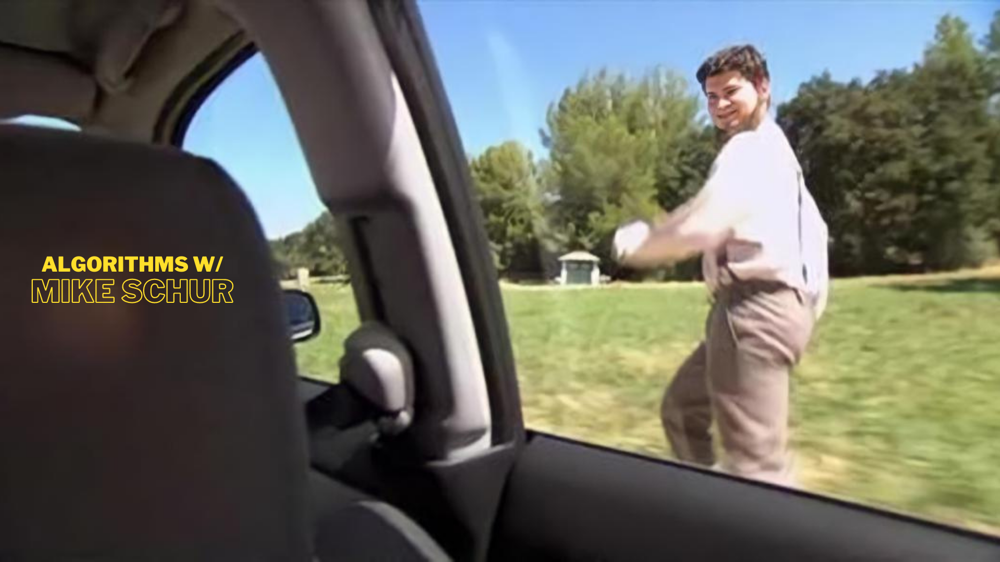

# Algorithms w/ Mike Schur

AwMS ("Algorithms w/ Mike Schur") is a three-part mini-series in which I demonstrate real-world applications of certain algorithms and offer viewers a visually engaging experience by leveraging their love of TV shows and disinterest in studies.

I'd take scenes and snippets from three shows - Brooklyn Nine-Nine, Parks and Recreation, and The Office (US) - and change the settings to match a certain algorithm (or a class of algorithms). There's a lot of entertaining material for the viewer to become hooked on, from treasure hunts to capturing criminals who have just escaped jail. The scenes will be carefully fabricated to suit an algorithm and provide the best analysis for every algorithm that I demonstrate.

[Streaming Link (All 3 episodes)](https://drive.google.com/drive/folders/1wRq-XxlozG1-zsrYYXFO2g8M4GDFx0Hn?usp=sharing)

## Motivation

Where do the students spend most of the time of the day in the 2020s? Textbooks? Research Papers? No! Netflix? Disney Plus? YES! Students love to binge shows day and night.
AwMS is a novel attempt to show the world how cool algorithms are and how analysis of these algorithms helps in real life. I would present an in-depth study of the decisions that the characters in AwMS must make (for example: find the most optimal approach as the bomb is going to explode any moment) to save the day.

I love to teach. I love visualizations. I love algorithms. So, I brought them all together, so anyone out there could simply watch a 20 minutes long episode of their favorite characters analyze and decide on using an optimal approach to be the hero of the day.

## Algorithms

The algorithms covered in this mini-series would be divided into 3 categories, where each episode would be covering a specific domain of algorithms.

### AwMS EP1: MST with The Nine Nine Squad

In the first episode, we uncover a dangerous assignment that Captain Holt has bestowed upon the 99th Precinct. The squad goes on a freaking MANHUNT for a group of convicts who've escaped from a prison van on the streets of Brooklyn.

I illustrate the usefulness of Minimum Spanning Trees in this episode and how algorithms such as Prim's and Kruskal's help find the optimal paths in a given graph.

Brooklyn Nine-Nine Character Illustrations Credit: Luigi Lucarelli (Instagram: helloluigi)

### AwMS EP2: Homomorphic Encryption with The Dunder Mifflin Scranton

In the second episode's first part, we uncover an identity theft by Jim as he enters the office dressed as Dwight. He claims that he accidentally discovered Dwight's spectacles for four dollars at a pharmacy shop and couldn't resist duplicating the rest of Dwight's outfit for eleven dollars. We also see how the office is trying to remember their server password after Michael plugged in a space heater and a fan in the same plug.
I show how Homomorphic Encryption is important in our life and how it protects our privacy while we spend hours upon hours every day on different social media platforms. I also discuss SHA-256 and Shor's algorithm, as well as how Quantum computers might usher in a new era in Internet security.

The Office Character Illustrations Credit: Marisa Livingston (Twitter: Marisa_Draws)

### AwMS EP3: SHA256 with The Dunder Mifflin Scranton

In the second episode's first part, we uncover how the office is trying to remember their server password after Michael plugged in a space heater and a fan in the same plug.

I discuss SHA-256 and Shor's algorithm, as well as how Quantum computers might usher in a new era in Internet security.

The Office Character Illustrations Credit: Marisa Livingston (Twitter: Marisa_Draws)

## Usecase

Learning your favorite algorithms was never this fun. This mini-series could help students better understand the applications behind the pieces of code they see in their copy of CLRS. Seeing characters choose between 2 different approaches (2 different algorithms) would help students internalize the cool aspect of the algorithm analysis and why it’s so useful.

## References

[1] Brooklyn Nine-Nine

Brooklyn Nine-Nine is an American police procedural comedy television series.

[2] The Office (US)

The Office is an American mockumentary sitcom television series that depicts the everyday work lives of office employees in the Scranton, Pennsylvania, branch of the fictional Dunder Mifflin Paper Company.

_© No licenses have been acquired for the recreation of the content. All the rights belong to the National Broadcasting Company, United States._
